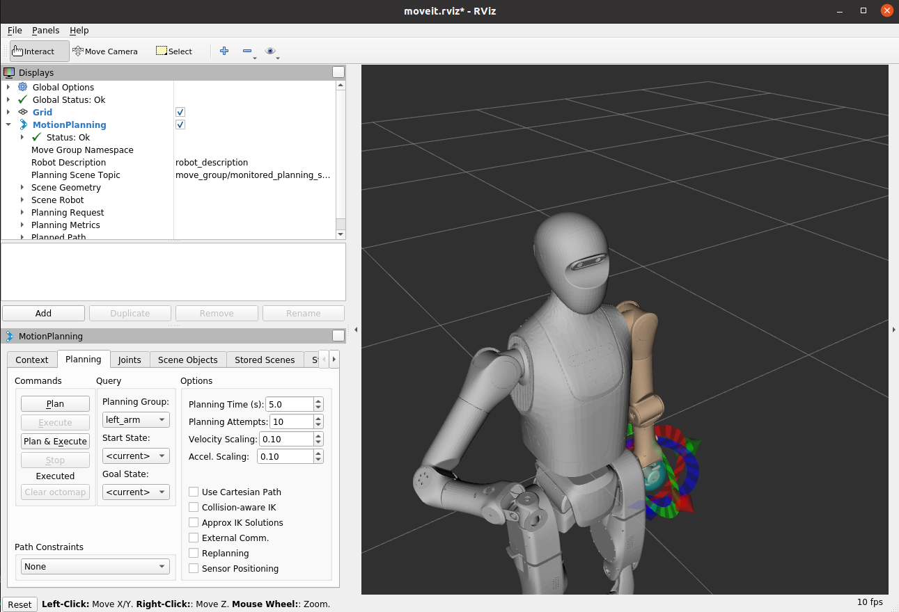

Instructions:

To build the docker image: currently Ubuntu20.04 + ROS noetic:

step1: Build the image
  
  go to ./scripts, run **build.bash**


step2: Build the container
  
  go to ./scripts, run **run.bash**

Step3: initial setup

  not you should be in the container,go to ws/scripts, run **bootstrap_ws.bash**

Step4: sanity check

  now you should be able to run roscore, and run rviz
=======


### If running build.bash get the bug (docker: 'compose' is not a docker command.)
 ```
 
sudo apt-get update
sudo apt-get install -y docker-compose-plugin

# test 
docker compose version
#if could not find 
sudo apt-get update
sudo apt-get install -y ca-certificates curl gnupg
sudo install -m 0755 -d /etc/apt/keyrings
curl -fsSL https://download.docker.com/linux/ubuntu/gpg | sudo gpg --dearmor -o /etc/apt/keyrings/docker.gpg
echo "deb [arch=$(dpkg --print-architecture) signed-by=/etc/apt/keyrings/docker.gpg] \
https://download.docker.com/linux/ubuntu $(. /etc/os-release; echo $VERSION_CODENAME) stable" | \
sudo tee /etc/apt/sources.list.d/docker.list > /dev/null
sudo apt-get update
sudo apt-get install -y docker-compose-plugin

 ```
>>>>>>> de6d8eb5d2413f9264c24e8c0b276e4c55b8a2bc


# pull down this branch 
```
sudo apt update
sudo apt install -y git git-lfs
git lfs install
*********
git clone git@github.com:Chiniklas/tiangong_infra_ws.git
cd tiangong_infra_ws
git checkout tiangong_infra_ws_sim

**********
if you already clone this repo 
cd tiangong_infra_ws
git fetch origin
git checkout tiangong_infra_ws_sim
***********
# only once 
git lfs install

# pull lfs 
git lfs pull
# verification 
git lfs ls-files | grep -i '\.stl'
file ws/tg2_ws/src/tg2_description/urdf/meshes/ankle_pitch_l_link.STL

#  “Stereo lithography” or “Binary STL”，not ASCII 

```
# Moveit config workspace 
- prepare two terminal (check if the stl file inside the meshes is binare  )
- both terminal should run following command 
```
  cd ws/tg2_ws
  catkin_make
  source devel/setup.bash
```
- you can run the following command in one of those terminal 
```
  roslaunch tg2_moveit_config demo.launch
```

if you meet the error 
[ERROR] [1758122609.998725603]: Unable to connect to move_group action server 'move_group' within allotted time (30s)

### press the reset button in left under side until 

[INFO] [1758122677.148997170]: MoveGroup context            initialization complete
You can start planning now!

- run the following command in other terminal
```
rosrun tg2_moveit_config point_demo.py _group_name:="right_arm" _planner:=ompl _xyz:=[0.3,-0.3,0.2] _rpy:=[3.14,1.607,0.0]
rosrun tg2_moveit_config point_demo.py _group_name:="left_arm" _xyz=[0.4,0.4,0.4]

```

the robot arm will move to the target point _xyz:=[0.3,-0.3,0.2] and the last joint will rotate to _rpy:=[3.14,1.607,0.0] 
- if you want to record the full trajctory 
```
rosrun tg2_moveit_config point_with_log.py   _group_name:="right_arm"   _planner:=ompl   _xyz:="[0.3, -0.3, 0.6]"   _rpy:="[0, 1,6, 0]" 
```
the traj will log in  
### ws/tg2_ws/src/tg2_moveit_config/scripts/traj_csv.csv
- replay 
```
rosrun tg2_moveit_config replay_csv.py   _group_name:=left_arm   _csv_path:=/tiangong_infra_ws/ws/tg2_ws/src/tg2_moveit_config/scripts/traj_csv.csv   _time_scale:=1.0   _align_to_current:=true
```